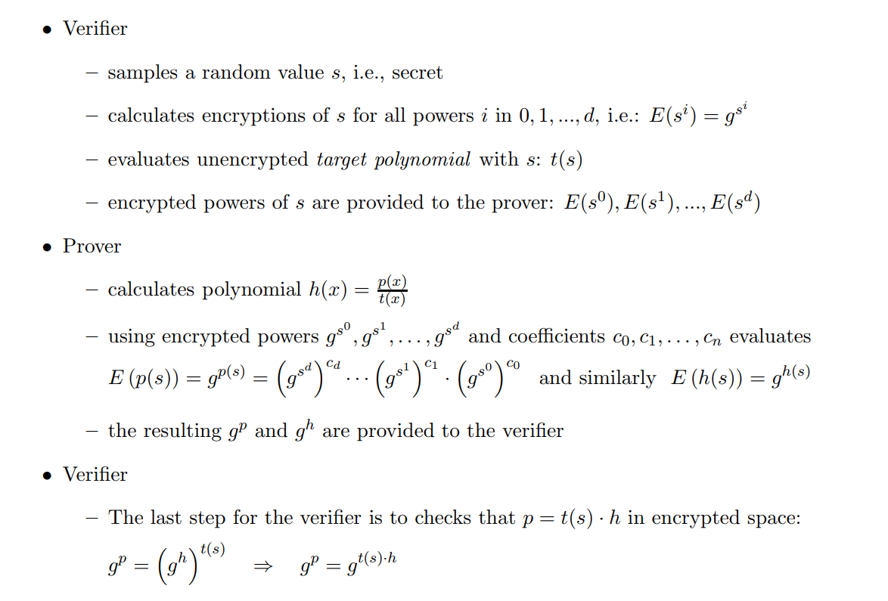

# zksnark
Just some implementation of mathematics concepts that I learned during my research about ZK-SNARK

## 1. Finite Group over prime number
- https://www.youtube.com/playlist?list=PLi01XoE8jYoi3SgnnGorR_XOW3IcK-TP6##

## 2. Homomorphic encryption(HE)
- Lets g is a generator of group G, for each item x in G we have: homomorphic encryption of x = g^x % p where p is extremely large prime number
- In short: E(x) = g^x % p
- Some properties of E(x)
  - Addition: a + b = E(a) + E(b) = E(a + b) = E(a).E(b). Proof: E(a + b) = g^(a+b) % p = g^a % p * g^b % p = E(a).E(b)
  - Multiplication: a * b = E(a * b) = E(a)^b % p. Proof: E(a * b) = E(a) + E(a) + ... E(a) = g^a .g^a...g^a = (g^a)^b % p

## 3. ZK Proof

### 3.1 Encrypted Polynomial

## 4. Cryptographic pairing
## 5. Shamir Secret Sharing
## 6. Pinocchio protocol
